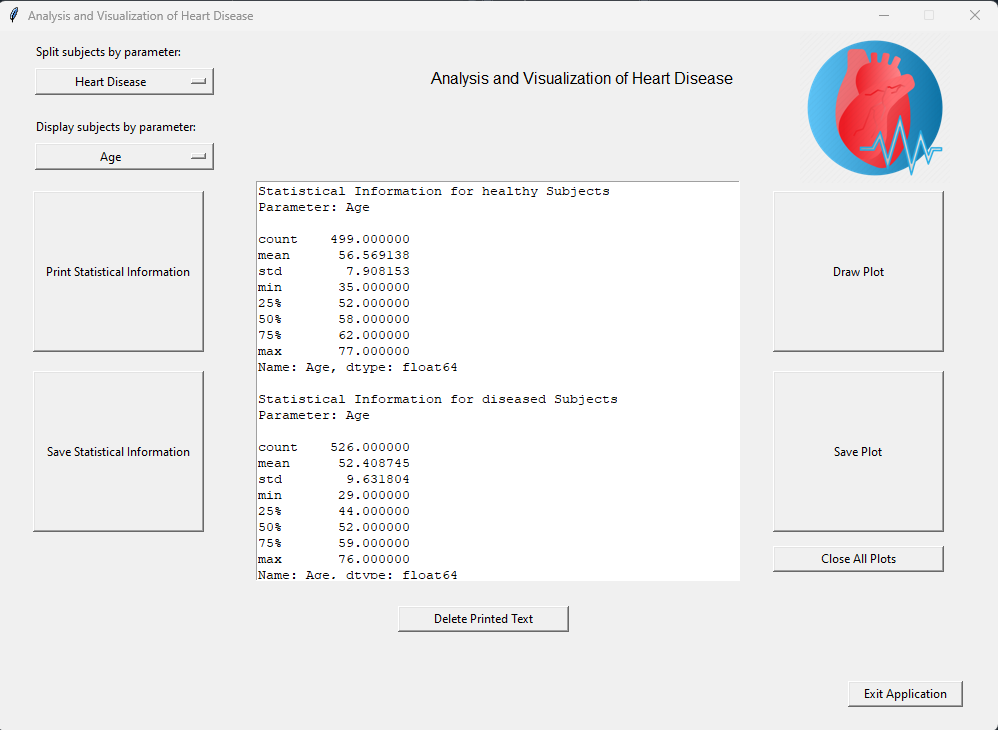
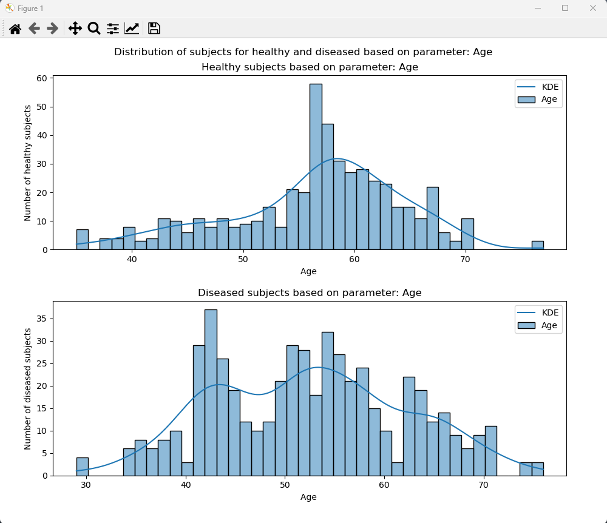

# Heart Disease Analysis

**Exploring and Analyzing Cardiovascular Health Data**




## Overview

Heart Disease Analysis involves a comprehensive examination of data related to cardiovascular health. The primary objective is to identify risk factors, diagnose potential conditions, and formulate treatment plans. This project harnesses a range of Python libraries for data analysis and visualization.

## Required Libraries

Before diving into this project, make sure you have the following Python libraries and dependencies installed:

- [tkinter](https://docs.python.org/3/library/tkinter.html): A library for creating graphical user interfaces (GUIs).
- [PIL (Python Imaging Library)](https://pillow.readthedocs.io/en/stable/): A library for working with images.
- [seaborn](https://seaborn.pydata.org/): A data visualization library based on Matplotlib, ideal for statistical graphics.
- [pandas](https://pandas.pydata.org/): A versatile library for data manipulation and analysis.
- [numpy](https://numpy.org/): A library for numerical computations.
- [matplotlib](https://matplotlib.org/): A library for crafting a wide range of plots and visualizations.

You can install these libraries with the following `pip` command:

```bash
pip install tkinter pillow seaborn pandas numpy matplotlib
